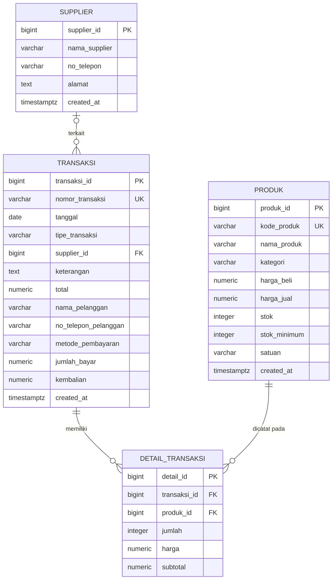
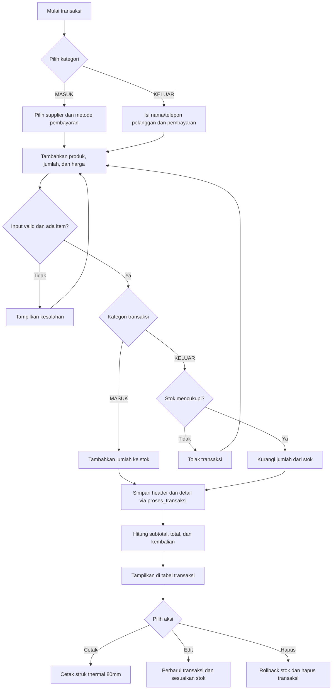

# GlowStock — Sistem Persediaan Toko Kosmetik

> 💄 **Kelola produk, stok, pemasok, dan transaksi toko kosmetik dalam satu aplikasi.** GlowStock membantu pemilik toko memantau persediaan, mencatat barang masuk dan keluar, serta melihat ringkasan nilai stok dengan lebih praktis.

## 🗺️ ERD Database

Database memiliki empat tabel inti. `detail_transaksi` menghubungkan transaksi dengan produk yang dicatat di dalamnya.



**Relasi singkat:** satu pemasok dapat terkait dengan banyak transaksi, sementara transaksi boleh tidak memiliki pemasok. Setiap detail transaksi wajib menunjuk satu transaksi dan satu produk. Pada level tabel, transaksi dapat memiliki nol atau banyak detail; fungsi `proses_transaksi` memastikan transaksi yang dicatat melalui aplikasi berisi minimal satu produk.

## 🧾 Tabel Database

- **`supplier`** — nama, kontak, dan alamat pemasok.
- **`produk`** — kode, nama, kategori, harga beli/jual, jumlah stok, stok minimum, dan satuan produk.
- **`transaksi`** — nomor, tanggal, tipe (`MASUK` atau `KELUAR`), pemasok opsional, nama dan telepon pelanggan, metode pembayaran, jumlah bayar, kembalian, keterangan, dan total transaksi.
- **`detail_transaksi`** — daftar produk per transaksi, termasuk jumlah dan harga saat transaksi. `subtotal` dihitung otomatis dari jumlah × harga.

## ✨ Fitur Utama

- 🏠 **Dashboard persediaan** — ringkasan produk, total stok, nilai persediaan, dan jumlah transaksi.
- 🌙 **Dark Mode** — ganti tema lewat tombol bulan/matahari di topbar. Pilihan disimpan di `localStorage` dengan key `glowstock_theme` dan diterapkan ke sidebar, kartu, tabel, modal, dan komponen lainnya.
- 📈 **Grafik dashboard dengan Chart.js** — grafik garis *Tren Stok* merangkum stok per kategori, sedangkan grafik doughnut menunjukkan jumlah produk per kategori.
- 💄 **Kelola produk** — simpan data produk, harga, kategori, satuan, dan ambang stok minimum.
- 📦 **Kelola pemasok** — catat informasi supplier yang bekerja sama dengan toko.
- 🔄 **Transaksi lengkap** — pilih transaksi ke supplier (`MASUK`) atau ke pelanggan (`KELUAR`). Penjualan mencatat nama dan telepon pelanggan. Metode pembayaran pelanggan mencakup Cash, QRIS, Transfer, dan E-Wallet; supplier mendukung Cash, Transfer Bank, QRIS, dan E-Wallet. Jumlah bayar supplier opsional, sedangkan kembalian penjualan dihitung otomatis.
- 🧾 **Cetak struk** — cetak setiap transaksi dengan layout thermal 80mm, lengkap dengan informasi pihak, produk, pembayaran, dan footer.
- ✏️ **Edit dan hapus transaksi** — perubahan transaksi memperbarui rincian dan stok; penghapusan membalik dampak transaksi ke stok.
- 🧩 **Tabel transaksi informatif** — memuat nomor, tanggal, tipe, pihak, metode, status lunas, total, serta aksi cetak, edit, dan hapus.
- 🚦 **Pantau stok menipis** — lihat produk yang perlu segera diperhatikan berdasarkan stok minimum.
- 📊 **Laporan persediaan** — tinjau transaksi dan nilai persediaan produk.
- 🛡️ **Validasi stok** — transaksi barang keluar ditolak jika jumlah yang diminta melebihi stok tersedia.
- ✨ **Animasi antarmuka** — efek fade/slide, hover, dan ikon produk yang mengambang di hero.

## 🔁 Alur Transaksi



Pembuatan transaksi dilakukan oleh fungsi database `proses_transaksi`; validasi, detail, total, dan perubahan stok untuk proses ini ditangani dalam satu pemanggilan database. Edit dan hapus dilakukan dari frontend dengan menyesuaikan kembali stok berdasarkan rincian lama dan baru.

## 🚀 Cara Menjalankan

1. Buat project di [Supabase](https://supabase.com/) dan buka **SQL Editor**.
2. Jalankan seluruh isi [`database/database.sql`](database/database.sql) untuk membuat tabel, view, fungsi transaksi, indeks, dan kebijakan demo.
3. Jika fungsi transaksi perlu dipasang ulang, jalankan [`database/rpc_setup.sql`](database/rpc_setup.sql).
4. Periksa URL project dan publishable key pada [`backend/supabase.js`](backend/supabase.js), lalu sesuaikan dengan project Supabase Anda.
5. Buka [`frontend/index.html`](frontend/index.html) di browser. Aplikasi memerlukan koneksi internet untuk mengakses Supabase.

## 🆕 Cara Pakai Fitur Baru

- 🌙 **Ganti tema:** tekan tombol bulan/matahari di topbar. Tema pilihan tersimpan otomatis di browser.
- 📊 **Lihat grafik:** buka Dashboard untuk membandingkan total stok dan jumlah produk pada tiap kategori. Grafik dimuat dari CDN Chart.js.
- 🛒 **Catat transaksi:** pilih kategori Supplier (`MASUK`) atau Pelanggan (`KELUAR`). Pilih metode pembayaran; pada transaksi pelanggan, isi nama pelanggan dan jumlah bayar untuk menghitung kembalian. Jumlah bayar supplier bersifat opsional.
- 🧾 **Kelola transaksi:** gunakan ikon cetak, edit, atau hapus pada kolom Aksi. Struk dicetak pada ukuran thermal 80mm; pilih ukuran kertas yang sesuai di dialog printer.

> 🔐 **Catatan keamanan:** SQL saat ini menggunakan kebijakan RLS demo yang mengizinkan akses luas tanpa login. Konfigurasi ini cocok untuk uji coba, bukan untuk data toko sungguhan. Sebelum penggunaan produksi, tambahkan autentikasi dan kebijakan RLS sesuai pengguna. Jangan pernah menaruh `service_role` key di frontend.

## 📁 Struktur Folder

```text
.
├── backend/
│   └── supabase.js          # Konfigurasi koneksi Supabase
├── database/
│   ├── database.sql         # Skema dan fungsi utama database
│   └── rpc_setup.sql        # Skrip pemasangan ulang fungsi transaksi
├── docs/
│   └── erd-skema-database.md # Dokumentasi ERD dan kamus data
├── frontend/
│   ├── index.html           # Halaman aplikasi
│   ├── css/
│   │   └── style.css        # Tampilan aplikasi
│   └── js/
│       └── app.js           # Interaksi dan logika frontend
└── README.md
```

## 🧰 Teknologi

- **HTML5** — struktur halaman aplikasi.
- **CSS3** — layout dan tampilan responsif.
- **JavaScript** — interaksi antarmuka dan komunikasi dengan database.
- **Chart.js** — grafik garis tren stok per kategori dan doughnut kategori produk.
- **localStorage** — menyimpan pilihan tema pengguna pada browser.
- **Supabase** — layanan API, koneksi client, dan Row Level Security.
- **PostgreSQL / PL/pgSQL** — penyimpanan relasional, view, serta fungsi pemrosesan transaksi.
- **Mermaid** — visualisasi ERD dan alur transaksi di dokumentasi.